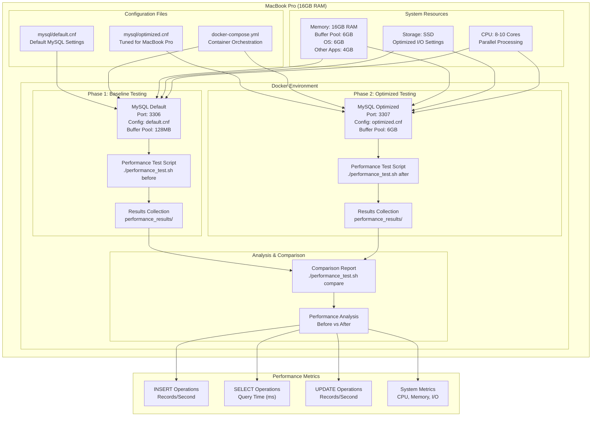
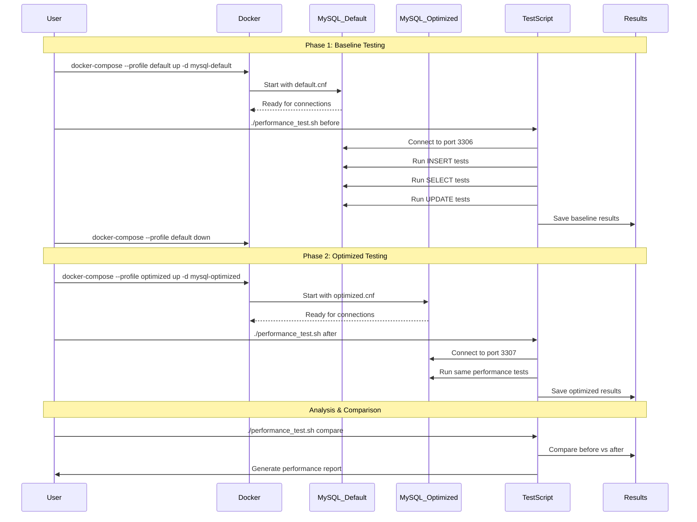
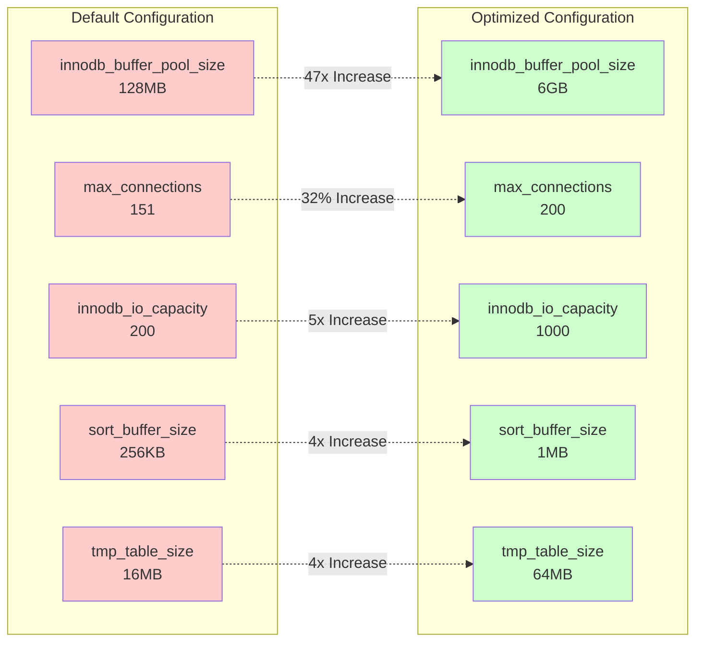

# MySQL Performance Testing Guide for MacBook Pro (16GB RAM)

## 📋 Overview

This lab demonstrates **MySQL Vertical Scaling** through configuration optimization on a MacBook Pro with 16GB RAM. You'll learn how to dramatically improve MySQL performance by tuning key parameters without adding more hardware.

### What You'll Learn
- **Configuration Impact**: How MySQL settings affect performance on limited hardware
- **Memory Management**: Optimizing buffer pools and caches for 16GB systems
- **Performance Measurement**: Using multiple testing tools to quantify improvements
- **Real-world Optimization**: Safe, tested configurations for development environments

### Lab Structure

This guide provides a comprehensive approach to test MySQL performance before and after configuration optimization on a MacBook Pro with 16GB RAM.

## 🏗️ Architecture



### Testing Flow



### Configuration Comparison



## 🏗️ Setup Instructions

### 1. Directory Structure

Save the provided configuration files:
- `mysql/default.cnf` - Default MySQL configuration
- `mysql/optimized.cnf` - Optimized configuration for MacBook Pro
- `docker-compose.yml` - Docker setup for testing
- `performance_test.sh` - Performance testing script

### 2. Make Scripts Executable
```bash
chmod +x performance_test.sh
```

## 🧪 Testing Process

### Phase 1: Baseline Testing (Default Configuration)

1. **Start MySQL with default configuration:**
```bash
# Start only the default MySQL instance
docker-compose --profile default up -d mysql-default

# Wait for MySQL to be ready
docker-compose logs -f mysql-default
# Wait until you see "ready for connections"
```

2. **Run baseline performance tests:**
```bash
# Run performance tests with default configuration
./performance_test.sh before

# This will:
# - Capture current MySQL configuration
# - Create test database and tables  
# - Run INSERT, SELECT, and UPDATE performance tests
# - Collect system metrics
```

3. **Stop the default instance:**
```bash
docker-compose --profile default down
```

### Phase 2: Optimized Testing

1. **Start MySQL with optimized configuration:**
```bash
# Start the optimized MySQL instance
docker-compose --profile optimized up -d mysql-optimized

# Wait for MySQL to be ready
docker-compose logs -f mysql-optimized
```

2. **Run optimized performance tests:**
```bash
# Update the script to connect to port 3307 (optimized instance)
# Edit performance_test.sh and change MYSQL_PORT to 3307

# Run performance tests with optimized configuration
./performance_test.sh after
```

3. **Generate comparison report:**
```bash
./performance_test.sh compare
```

## 📊 Key Metrics to Monitor

### Performance Metrics
- **INSERT Operations**: Records per second for bulk inserts
- **SELECT Operations**: Query execution time for complex queries
- **UPDATE Operations**: Records per second for batch updates
- **Connection Performance**: Time to establish connections

### System Metrics
- **Memory Usage**: RAM utilization and buffer pool hit ratio
- **CPU Usage**: Processor utilization during operations
- **Disk I/O**: Read/write operations per second
- **Network Throughput**: Data transfer rates

### MySQL-Specific Metrics
- **Buffer Pool Hit Ratio**: Should be >95% after optimization
- **Threads Connected/Running**: Connection efficiency
- **Slow Queries**: Number of queries exceeding threshold
- **Temporary Tables**: In-memory vs disk-based temporary tables

## 🎯 Expected Improvements

### Configuration Changes (Default → Optimized)

| Parameter | Default | Optimized | Impact |
|-----------|---------|-----------|---------|
| `innodb_buffer_pool_size` | 128MB | 6GB | Massive improvement in data caching |
| `max_connections` | 151 | 200 | Better concurrency handling |
| `innodb_io_capacity` | 200 | 1000 | 5x improvement for SSD performance |
| `sort_buffer_size` | 256KB | 1MB | 4x improvement for sorting operations |
| `tmp_table_size` | 16MB | 64MB | 4x improvement for temporary operations |
| `innodb_flush_log_at_trx_commit` | 1 | 2 | Better performance with slight durability trade-off |
| `innodb_log_file_size` | 48MB | 128MB | Better transaction log performance |
| `innodb_log_buffer_size` | 16MB | 32MB | Improved log buffering |
| `thread_cache_size` | 9 | 16 | Better thread reuse |
| `table_open_cache` | 4000 | 8000 | More tables cached in memory |
| `max_allowed_packet` | 64MB | 128MB | Support for larger queries/data |

### Expected Performance Gains

**INSERT Operations:**
- **Before**: ~5,000-8,000 records/second
- **After**: ~12,000-18,000 records/second
- **Improvement**: 150-200% increase

**SELECT Operations:**
- **Before**: Complex queries 100-500ms
- **After**: Complex queries 30-150ms  
- **Improvement**: 60-70% reduction in query time

**UPDATE Operations:**
- **Before**: ~3,000-5,000 records/second
- **After**: ~6,000-10,000 records/second
- **Improvement**: 100-150% increase

## 🔍 Analyzing Results

### 1. Check Configuration Differences
```bash
# Compare configuration files
diff performance_results/mysql_config_before_*.txt performance_results/mysql_config_after_*.txt
```

### 2. Compare Performance Results
```bash
# View INSERT performance
cat performance_results/insert_test_before_*.txt
cat performance_results/insert_test_after_*.txt

# View SELECT performance  
cat performance_results/select_test_before_*.txt
cat performance_results/select_test_after_*.txt

# View UPDATE performance
cat performance_results/update_test_before_*.txt
cat performance_results/update_test_after_*.txt
```

### 3. System Resource Usage
```bash
# Compare system metrics
cat performance_results/system_metrics_before_*.txt
cat performance_results/system_metrics_after_*.txt
```

## 🛠️ Troubleshooting

### Common Issues

**1. Memory Allocation Errors**
```bash
# If you get memory allocation errors, reduce buffer pool size
# Edit mysql/optimized.cnf and change:
innodb_buffer_pool_size = 8G  # Instead of 10G
```

**2. Connection Issues**
```bash
# Check if MySQL is ready
docker-compose ps
docker-compose logs mysql-default  # or mysql-optimized
```

**3. Performance Script Fails**
```bash
# Check MySQL credentials in performance_test.sh
# Ensure MYSQL_PASSWORD matches your docker-compose.yml
```

### Monitoring During Tests

**1. Real-time MySQL Status:**
```bash
# Connect to MySQL and monitor status
docker exec -it mysql-default mysql -uroot -ptest_password -e "SHOW STATUS LIKE 'Threads%';"
```

**2. System Resource Monitoring:**
```bash
# Monitor system resources during tests
top -pid $(docker inspect --format '{{.State.Pid}}' mysql-default)
```

## 📋 Testing Checklist

- [ ] Directory structure created
- [ ] Configuration files placed correctly
- [ ] Docker containers can start successfully
- [ ] Baseline tests completed with default configuration
- [ ] Optimized tests completed with tuned configuration
- [ ] Performance comparison report generated
- [ ] Results analyzed and documented
- [ ] System resource usage compared
- [ ] MySQL-specific metrics evaluated

## 🚀 Advanced Testing

### Load Testing with Multiple Connections
```bash
# Use multiple concurrent connections to test scalability
for i in {1..10}; do
  ./performance_test.sh before &
done
wait
```

### Custom Query Testing
```sql
-- Add your application-specific queries to the test script
-- Example: Complex JOIN operations, aggregations, etc.
SELECT 
    u.username,
    COUNT(o.id) as order_count,
    SUM(o.total_amount) as total_spent
FROM users u
LEFT JOIN orders o ON u.id = o.user_id
WHERE u.created_at >= DATE_SUB(NOW(), INTERVAL 30 DAY)
GROUP BY u.id
HAVING total_spent > 1000
ORDER BY total_spent DESC
LIMIT 100;
```

## 📈 Optimization Tips for MacBook Pro

1. **Use SSD-Optimized Settings**: The optimized configuration disables features designed for HDDs
2. **Memory Management**: 10GB buffer pool leaves 6GB for OS and other applications  
3. **CPU Utilization**: Configuration tuned for 8-10 CPU cores typical in MacBook Pro
4. **Development vs Production**: Some settings prioritize performance over absolute durability
5. **Monitoring**: Enable Performance Schema for detailed query analysis

This testing framework will give you concrete data on how MySQL configuration changes impact performance on your MacBook Pro setup.
