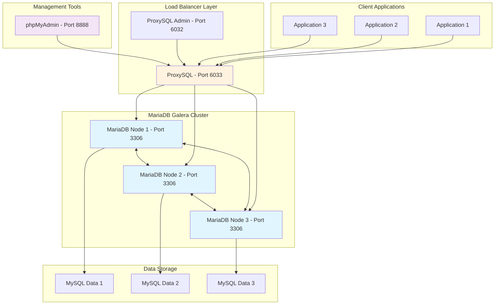
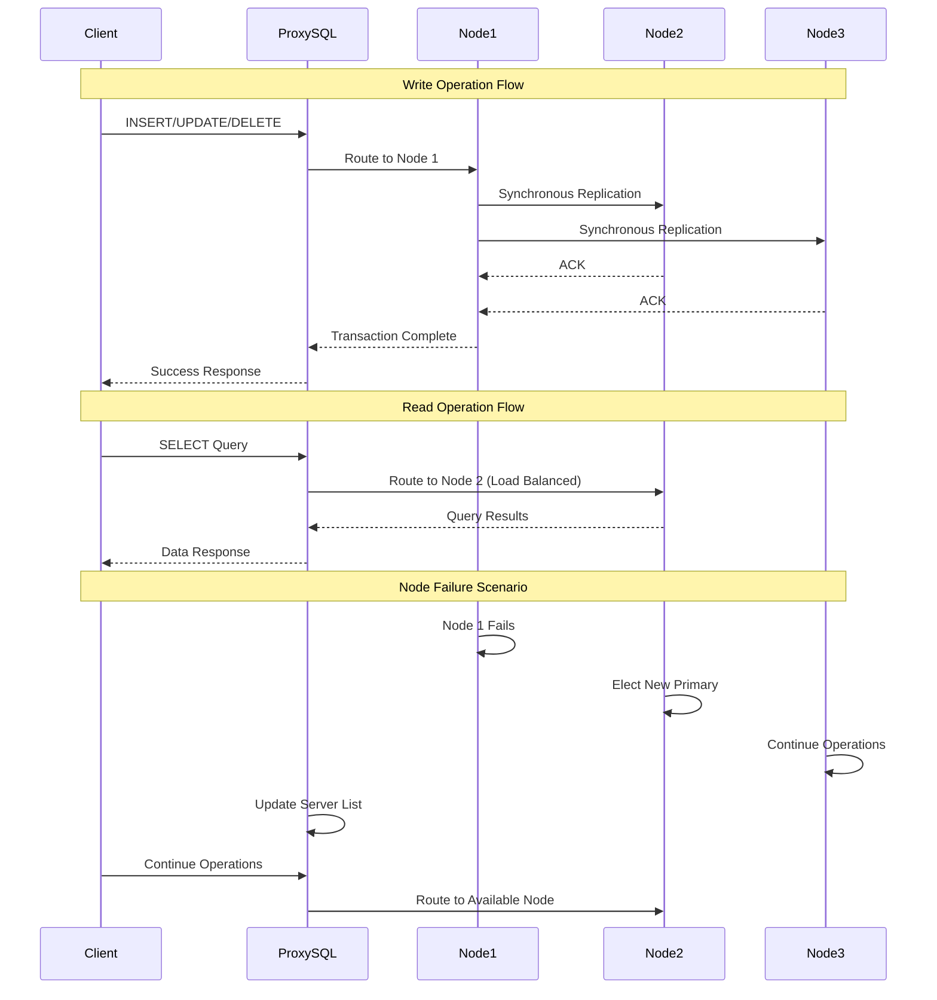

# MySQL Master-Active-Active Replication with MariaDB Galera Cluster

## 🎯 Learning Objectives

This lab demonstrates **Master-Active-Active replication** using MariaDB Galera Cluster, a synchronous multi-master replication solution. You'll learn:

- **Active-Active Architecture**: How multiple master nodes can handle both reads and writes simultaneously
- **Synchronous Replication**: Understanding real-time data consistency across all nodes
- **High Availability**: Building fault-tolerant database clusters
- **Load Balancing**: Using ProxySQL to distribute queries across cluster nodes
- **Cluster Management**: Monitoring and maintaining a multi-node database cluster
- **Failover Handling**: How the cluster responds to node failures

### What You'll Learn
- **Galera Cluster Concepts**: Understanding synchronous multi-master replication
- **ProxySQL Configuration**: Setting up intelligent load balancing
- **Cluster Monitoring**: Tools and techniques for cluster health monitoring
- **Performance Optimization**: Tuning cluster performance for different workloads
- **Troubleshooting**: Common issues and resolution strategies

## 🏗️ Architecture



### Cluster Flow



## 🔧 Configuration Details

### Galera Cluster Configuration

#### Core Galera Settings (`config/galera.cnf`)
```ini
[mysqld]
# Galera Provider Configuration
wsrep_on=ON
wsrep_provider=/usr/lib/galera/libgalera_smm.so
wsrep_cluster_name=galera_cluster
wsrep_cluster_address=gcomm://galera-node1,galera-node2,galera-node3
wsrep_node_name=node1
wsrep_node_address=galera-node1

# SST Configuration (State Snapshot Transfer)
wsrep_sst_method=rsync

# Performance Settings
wsrep_sync_wait=1
wsrep_causal_reads=ON
innodb_flush_log_at_trx_commit=0
innodb_buffer_pool_size=122M

# Connection Settings
max_connections=1000
thread_handling=pool-of-threads
```

#### Node-Specific Configurations
- **Node 1**: Bootstrap node with `--wsrep-new-cluster`
- **Node 2**: Joins cluster automatically
- **Node 3**: Joins cluster automatically

### ProxySQL Configuration

#### Load Balancing Rules (`config/proxysql.cnf`)
```ini
mysql_servers =
(
    { address="172.30.0.10", port=3306, hostgroup=10, max_connections=200 },
    { address="172.30.0.11", port=3306, hostgroup=10, max_connections=200 },
    { address="172.30.0.12", port=3306, hostgroup=10, max_connections=200 }
)

mysql_query_rules =
(
    {
        rule_id=1
        active=1
        match_pattern="^SELECT .* FOR UPDATE"
        destination_hostgroup=10
        apply=1
    },
    {
        rule_id=2
        active=1
        match_pattern="^SELECT"
        destination_hostgroup=10
        apply=1
    }
)
```

## 🚀 Step-by-Step Setup Instructions

### Prerequisites
- Docker and Docker Compose installed
- At least 4GB RAM available
- Basic understanding of MySQL/MariaDB

### Step 1: Environment Setup

1. **Navigate to the lab directory:**
```bash
cd labs/3-master-active-active
```

2. **Verify configuration files:**
```bash
ls -la config/
ls -la init-scripts/
```

### Step 2: Start the Cluster

1. **Start all services:**
```bash
docker-compose up -d
```

2. **Monitor cluster initialization:**
```bash
# Check container status
docker-compose ps

# Monitor logs for cluster formation
docker-compose logs -f galera-node1
```

3. **Wait for cluster to be ready (30-60 seconds):**
```bash
# Check cluster status
docker exec galera-node1 mysql -uroot -prootpassword -e "SHOW STATUS LIKE 'wsrep%';"
```

### Step 3: Verify Cluster Health

1. **Check cluster size and status:**
```bash
# Verify all nodes are connected
docker exec galera-node1 mysql -uroot -prootpassword -e "
SHOW STATUS LIKE 'wsrep_cluster_size';
SHOW STATUS LIKE 'wsrep_cluster_status';
SHOW STATUS LIKE 'wsrep_connected';
SHOW STATUS LIKE 'wsrep_ready';
"
```

2. **Expected output:**
```
wsrep_cluster_size: 3
wsrep_cluster_status: Primary
wsrep_connected: ON
wsrep_ready: ON
```

### Step 4: Test Active-Active Replication

1. **Create test data on different nodes:**
```bash
# Write to Node 1
docker exec galera-node1 mysql -uroot -prootpassword -e "
USE testdb;
CREATE TABLE IF NOT EXISTS cluster_test (
    id INT PRIMARY KEY AUTO_INCREMENT,
    node_name VARCHAR(50),
    message TEXT,
    created_at TIMESTAMP DEFAULT CURRENT_TIMESTAMP
);
INSERT INTO cluster_test (node_name, message) VALUES ('node1', 'Hello from Node 1');
"

# Write to Node 2
docker exec galera-node2 mysql -uroot -prootpassword -e "
USE testdb;
INSERT INTO cluster_test (node_name, message) VALUES ('node2', 'Hello from Node 2');
"

# Write to Node 3
docker exec galera-node3 mysql -uroot -prootpassword -e "
USE testdb;
INSERT INTO cluster_test (node_name, message) VALUES ('node3', 'Hello from Node 3');
"
```

2. **Verify data replication:**
```bash
# Check data on all nodes
docker exec galera-node1 mysql -uroot -prootpassword -e "USE testdb; SELECT * FROM cluster_test;"
docker exec galera-node2 mysql -uroot -prootpassword -e "USE testdb; SELECT * FROM cluster_test;"
docker exec galera-node3 mysql -uroot -prootpassword -e "USE testdb; SELECT * FROM cluster_test;"
```

### Step 5: Test Load Balancing

1. **Connect through ProxySQL:**
```bash
# Connect to ProxySQL
docker exec -it proxysql mysql -h127.0.0.1 -P6033 -uroot -prootpassword
```

2. **Test load balancing:**
```sql
-- Check which node you're connected to
SELECT @@hostname, @@port;

-- Perform operations
USE testdb;
INSERT INTO cluster_test (node_name, message) VALUES ('proxysql', 'Hello from ProxySQL');
SELECT * FROM cluster_test;
```

### Step 6: Test High Availability

1. **Simulate node failure:**
```bash
# Stop one node
docker-compose stop galera-node2

# Check cluster status
docker exec galera-node1 mysql -uroot -prootpassword -e "SHOW STATUS LIKE 'wsrep_cluster_size';"
```

2. **Verify cluster continues operating:**
```bash
# Write to remaining nodes
docker exec galera-node1 mysql -uroot -prootpassword -e "
USE testdb;
INSERT INTO cluster_test (node_name, message) VALUES ('node1', 'Cluster still working');
"

docker exec galera-node3 mysql -uroot -prootpassword -e "
USE testdb;
INSERT INTO cluster_test (node_name, message) VALUES ('node3', 'Cluster still working');
"
```

3. **Restart the failed node:**
```bash
# Restart the node
docker-compose start galera-node2

# Wait for rejoin
sleep 30

# Verify cluster size
docker exec galera-node1 mysql -uroot -prootpassword -e "SHOW STATUS LIKE 'wsrep_cluster_size';"
```

## 🔍 Monitoring and Management

### Cluster Status Monitoring

1. **Check cluster health:**
```bash
# Comprehensive cluster status
docker exec galera-node1 mysql -uroot -prootpassword -e "
SHOW STATUS LIKE 'wsrep%';
SHOW PROCESSLIST;
"
```

2. **Monitor ProxySQL:**
```bash
# Connect to ProxySQL admin interface
docker exec -it proxysql mysql -h127.0.0.1 -P6032 -uadmin -padmin

# Check server status
SELECT * FROM mysql_servers;

# Check query statistics
SELECT * FROM stats_mysql_global;
```

### phpMyAdmin Access

- **URL**: http://localhost:8888
- **Server**: `proxysql`
- **Username**: `root`
- **Password**: `rootpassword`

## 🛠️ Troubleshooting

### Common Issues and Solutions

#### 1. Node Not Joining Cluster
```bash
# Check node connectivity
docker exec galera-node2 ping galera-node1

# Check node logs
docker logs galera-node2

# Verify configuration
docker exec galera-node2 cat /etc/mysql/conf.d/galera.cnf
```

#### 2. Cluster Split-Brain
```bash
# Check cluster status on all nodes
docker exec galera-node1 mysql -uroot -prootpassword -e "SHOW STATUS LIKE 'wsrep_cluster_status';"
docker exec galera-node2 mysql -uroot -prootpassword -e "SHOW STATUS LIKE 'wsrep_cluster_status';"
docker exec galera-node3 mysql -uroot -prootpassword -e "SHOW STATUS LIKE 'wsrep_cluster_status';"
```

#### 3. ProxySQL Connection Issues
```bash
# Check ProxySQL logs
docker logs proxysql

# Verify ProxySQL can reach nodes
docker exec proxysql ping galera-node1
docker exec proxysql ping galera-node2
docker exec proxysql ping galera-node3
```

### Performance Optimization

1. **Tune Galera settings:**
```ini
# Optimize for your workload
wsrep_sync_wait=1
wsrep_causal_reads=ON
innodb_flush_log_at_trx_commit=0
```

2. **Monitor performance metrics:**
```bash
# Check replication lag
docker exec galera-node1 mysql -uroot -prootpassword -e "
SHOW STATUS LIKE 'wsrep_flow_control_paused';
SHOW STATUS LIKE 'wsrep_local_recv_queue';
SHOW STATUS LIKE 'wsrep_local_send_queue';
"
```

## 📊 Access Information

| Service | Port | Description | Credentials |
|---------|------|-------------|-------------|
| Galera Node 1 | 3306 | Direct access to Node 1 | root/rootpassword |
| Galera Node 2 | 3307 | Direct access to Node 2 | root/rootpassword |
| Galera Node 3 | 3308 | Direct access to Node 3 | root/rootpassword |
| ProxySQL | 6033 | Load balanced MySQL interface | root/rootpassword |
| ProxySQL Admin | 6032 | ProxySQL administration | admin/admin |
| phpMyAdmin | 8888 | Web-based management | root/rootpassword |

## 🧹 Cleanup

```bash
# Stop all services
docker-compose down

# Remove all data (optional)
docker-compose down -v
rm -rf mysql*_data proxysql_data
```

## 📚 Key Concepts Learned

1. **Synchronous Replication**: All nodes have identical data in real-time
2. **Active-Active Architecture**: All nodes can handle reads and writes
3. **High Availability**: Cluster continues operating with node failures
4. **Load Balancing**: Intelligent distribution of queries across nodes
5. **Cluster Management**: Monitoring and maintaining multi-node databases
6. **Failover Handling**: Automatic recovery and rebalancing

## 🎓 Next Steps

- Experiment with different cluster sizes
- Test with application workloads
- Implement monitoring and alerting
- Explore advanced ProxySQL features
- Learn about Galera Cluster backup strategies

This lab provides hands-on experience with enterprise-grade database clustering and high availability solutions.
