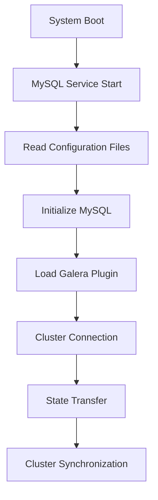

# galera.cnf

1. **Basic Settings**:
   - `bind-address=0.0.0.0`: Allows connections from any IP address
   - `default_storage_engine=innodb`: Uses InnoDB as the default storage engine
   - `binlog_format=ROW`: Uses row-based replication for better consistency
   - `innodb_autoinc_lock_mode=2`: Uses interleaved lock mode for better concurrency
   - `innodb_flush_log_at_trx_commit=0`: Prioritizes performance over durability (less safe but faster)
   - `innodb_buffer_pool_size=122M`: Sets the InnoDB buffer pool size to 122MB (relatively small)

2. **Galera Cluster Configuration**:
   - `wsrep_on=ON`: Enables Galera replication
   - `wsrep_provider`: Points to the Galera library
   - `wsrep_cluster_name=galera_cluster`: Names the cluster
   - `wsrep_cluster_address`: Defines the cluster nodes (galera-node1,2,3)
   - `wsrep_node_name=node1`: Identifies this node as node1
   - `wsrep_node_address=galera-node1`: Sets this node's address

3. **SST (State Snapshot Transfer) Configuration**:
   - `wsrep_sst_method=rsync`: Uses rsync for state transfer between nodes
   - `wsrep_sync_wait=1`: Ensures synchronous reads
   - `wsrep_causal_reads=ON`: Enables causal reads for better consistency

4. **Connection Settings**:
   - `max_connections=1000`: Allows up to 1000 concurrent connections
   - `max_allowed_packet=16M`: Maximum packet size for network communication
   - `thread_cache_size=128`: Caches 128 threads for reuse
   - `thread_stack=196K`: Allocates 196KB per thread
   - `thread_handling=pool-of-threads`: Uses thread pooling for better performance

5. **Query Cache**:
   - `query_cache_size=0`: Disables query cache
   - `query_cache_type=0`: Disables query cache type

6. **Logging**:
   - `slow_query_log=1`: Enables slow query logging
   - `slow_query_log_file=/var/log/mysql/mysql-slow.log`: Logs slow queries to this file
   - `long_query_time=2`: Queries taking longer than 2 seconds are logged

**Important Notes**:
1. This is a Galera Cluster configuration, which is a synchronous multi-master replication solution
2. The configuration is optimized for performance with some trade-offs in durability
3. The buffer pool size (122M) is quite small and might need adjustment based on available RAM
4. Query cache is disabled, which is recommended for MySQL 8.0+
5. The configuration includes thread pooling and connection optimization
6. Slow query logging is enabled for performance monitoring

**Potential Considerations**:
1. The `innodb_flush_log_at_trx_commit=0` setting prioritizes performance over durability. In production, you might want to use 1 or 2 for better data safety
2. The buffer pool size might need to be increased depending on your workload and available memory
3. The cluster is configured for three nodes (galera-node1, galera-node2, galera-node3)
4. The configuration uses rsync for state transfer, which is reliable but might be slower than other methods like xtrabackup

I'll create a table format explaining each parameter, its available values, and their meanings:

| Parameter | Available Values | Meaning |
|-----------|-----------------|----------|
| `binlog_format` | `ROW`<br>`STATEMENT`<br>`MIXED` | - `ROW`: Logs actual row changes (most safe, more space)<br>- `STATEMENT`: Logs SQL statements (less space, potential inconsistencies)<br>- `MIXED`: Uses both formats based on statement type |
| `innodb_autoinc_lock_mode` | `0`<br>`1`<br>`2` | - `0`: Traditional lock mode (safe but less concurrent)<br>- `1`: Consecutive lock mode (default, balanced)<br>- `2`: Interleaved lock mode (most concurrent, less safe) |
| `innodb_flush_log_at_trx_commit` | `0`<br>`1`<br>`2` | - `0`: Flush logs once per second (fastest, least safe)<br>- `1`: Flush logs at each commit (safest, slowest)<br>- `2`: Flush logs at each commit, but not to disk (balanced) |
| `wsrep_sst_method` | `rsync`<br>`xtrabackup`<br>`xtrabackup-v2`<br>`mysqldump`<br>`skip` | - `rsync`: Uses rsync for state transfer (reliable, slower)<br>- `xtrabackup`: Uses Percona XtraBackup (faster, requires more space)<br>- `xtrabackup-v2`: Newer version of xtrabackup<br>- `mysqldump`: Uses mysqldump (slower, less reliable)<br>- `skip`: Skips state transfer (for testing) |
| `wsrep_sync_wait` | `0`<br>`1`<br>`2`<br>`3`<br>`4` | - `0`: No synchronous reads<br>- `1`: Synchronous reads for all transactions<br>- `2`: Synchronous reads for read-write transactions<br>- `3`: Synchronous reads for read-only transactions<br>- `4`: Synchronous reads for autocommit transactions |
| `thread_handling` | `one-thread-per-connection`<br>`pool-of-threads`<br>`no-threads` | - `one-thread-per-connection`: Traditional thread model<br>- `pool-of-threads`: Thread pooling (better for many connections)<br>- `no-threads`: Single-threaded operation |
| `query_cache_size` | `0` to `2G` (in bytes) | - `0`: Disables query cache<br>- `>0`: Size of query cache in bytes<br>- Note: Query cache is deprecated in MySQL 8.0+ |
| `query_cache_type` | `0`<br>`1`<br>`2` | - `0`: Disables query cache<br>- `1`: Caches all queries (except those with SQL_NO_CACHE)<br>- `2`: Caches only queries with SQL_CACHE<br>- Note: Query cache is deprecated in MySQL 8.0+ |

**Important Notes:**
1. The current configuration uses performance-oriented values:
   - `binlog_format=ROW` for better consistency
   - `innodb_autoinc_lock_mode=2` for better concurrency
   - `innodb_flush_log_at_trx_commit=0` for better performance
   - Query cache disabled (recommended for MySQL 8.0+)

2. Some of these settings (like query cache) are deprecated in newer MySQL versions (8.0+)

3. The values chosen in your configuration are generally optimized for performance, but some (like `innodb_flush_log_at_trx_commit=0`) trade off durability for speed. In production environments, you might want to use more conservative values depending on your requirements for data safety.

# mysql.cnf

MySQL configuration file for a Group Replication setup. Let me break down the key sections:

1. **Basic MySQL Settings**:
   - `pid-file=/var/run/mysqld/mysqld.pid`: Location of the process ID file
   - `socket=/var/run/mysqld/mysqld.sock`: MySQL socket file location
   - `datadir=/var/lib/mysql`: Data directory location
   - `bind-address=0.0.0.0`: Allows connections from any IP address
   - `server-id=1`: Unique identifier for this MySQL instance

2. **Binary Log Settings**:
   - `log-bin=mysql-bin`: Enables binary logging with prefix 'mysql-bin'
   - `binlog_format=ROW`: Uses row-based replication for better consistency
   - `binlog_checksum=NONE`: Disables binary log checksums
   - `sync_binlog=1`: Ensures binary log is synchronized to disk after each transaction

3. **GTID (Global Transaction Identifier) Settings**:
   - `gtid_mode=ON`: Enables GTID-based replication
   - `enforce_gtid_consistency=ON`: Ensures all transactions are GTID-compatible

4. **Group Replication Settings**:
   - `transaction_write_set_extraction=XXHASH64`: Uses XXHASH64 for write set extraction
   - `group_replication_group_name`: Unique identifier for the replication group
   - `group_replication_start_on_boot=ON`: Automatically starts replication on server boot
   - `group_replication_local_address="mysql-node1:33061"`: This node's replication address
   - `group_replication_group_seeds`: List of all nodes in the group
   - `group_replication_bootstrap_group=ON`: This node can bootstrap the group

5. **InnoDB Settings**:
   - `innodb_flush_log_at_trx_commit=1`: Highest durability setting (safest)
   - `innodb_flush_method=O_DIRECT`: Bypasses OS cache for better performance
   - `innodb_buffer_pool_size=256M`: InnoDB buffer pool size (256MB)

6. **Connection Settings**:
   - `max_connections=200`: Maximum concurrent connections
   - `max_allowed_packet=64M`: Maximum packet size for network communication

7. **Character Set Settings**:
   - `character-set-server=utf8mb4`: Server character set
   - `collation-server=utf8mb4_unicode_ci`: Server collation
   - Client section also uses `utf8mb4` character set

**Key Differences from Previous Configuration**:
1. This is a Group Replication setup (not Galera)
2. Uses GTID-based replication
3. More conservative durability settings (`innodb_flush_log_at_trx_commit=1`)
4. Larger buffer pool (256M vs 122M)
5. Different replication architecture (Group Replication vs Galera)

**Important Notes**:
1. This is a primary node configuration (node1) in a Group Replication setup
2. The configuration is more focused on data safety than the previous Galera setup
3. Uses modern MySQL features like GTID and Group Replication
4. Character set is properly configured for full Unicode support (utf8mb4)
5. The node is configured to bootstrap the group (`group_replication_bootstrap_group=ON`)

**Potential Considerations**:
1. The buffer pool size (256M) might need adjustment based on available RAM
2. The `max_connections=200` is lower than the previous configuration (1000)
3. The configuration uses a more conservative approach to data durability
4. The group replication is set up for three nodes (mysql-node1, mysql-node2, mysql-node3)


How Galera Cluster works, its architecture, and key components:

### Galera Cluster Overview

Galera Cluster is a synchronous multi-master replication solution for MySQL/MariaDB that provides:
- True multi-master replication
- Synchronous replication
- Automatic node provisioning
- Automatic failover
- No slave lag
- No data loss

### Architecture Components

1. **Node Types**:
   - Primary Component (PC): The main MySQL/MariaDB server
   - Galera Replication Plugin (wsrep): Handles replication
   - Database Management System (DBMS): Manages data storage

2. **Key Components**:
   ```
   [Application] → [MySQL/MariaDB Node]
                      ├── Primary Component (PC)
                      ├── Galera Replication Plugin (wsrep)
                      └── Database Management System (DBMS)
   ```

### How It Works

1. **Write Operations**:
   ```
   [Client] → [Node 1] → [Certification] → [Apply] → [Commit]
                     ↓
                [Broadcast]
                     ↓
   [Node 2] → [Certification] → [Apply] → [Commit]
                     ↓
   [Node 3] → [Certification] → [Apply] → [Commit]
   ```

   - When a write occurs on any node:
     1. The transaction is executed locally
     2. The changes are broadcast to all other nodes
     3. Each node certifies the transaction
     4. If certified, the transaction is applied
     5. All nodes commit the transaction

2. **Certification Process**:
   - Each transaction is assigned a unique identifier
   - Nodes verify transaction conflicts
   - If no conflicts, transaction is certified
   - If conflicts exist, transaction is rolled back

3. **Synchronization Methods**:
   - **IST (Incremental State Transfer)**:
     - Transfers only missing transactions
     - Faster for nodes that were briefly disconnected
   
   - **SST (State Snapshot Transfer)**:
     - Full copy of the database
     - Used for new nodes or severely out-of-sync nodes
     - Methods available:
       - `rsync` (default)
       - `xtrabackup`
       - `mysqldump`

### Key Features

1. **Synchronous Replication**:
   - All nodes have the same data
   - No slave lag
   - No data loss
   - All nodes are writable

2. **Automatic Node Provisioning**:
   - New nodes automatically sync with the cluster
   - Uses SST or IST as needed
   - No manual configuration required

3. **Automatic Failover**:
   - If a node fails, others continue operating
   - No manual intervention needed
   - Automatic reconnection when node recovers

4. **Conflict Resolution**:
   - Uses certification-based replication
   - Prevents conflicts at the transaction level
   - Automatic rollback of conflicting transactions

### Cluster States

1. **Node States**:
   - `SYNCED`: Fully synchronized
   - `DONOR`: Providing state transfer
   - `JOINER`: Receiving state transfer
   - `JOINED`: Connected but not fully synced
   - `DONOR/DESYNCED`: Providing state transfer but not synced

2. **Cluster States**:
   - `PRIMARY`: Normal operation
   - `NON-PRIMARY`: Split-brain or quorum loss
   - `DISCONNECTED`: Node is offline

### Best Practices

1. **Network Configuration**:
   - Low latency between nodes
   - Dedicated network for replication
   - Proper firewall rules

2. **Hardware Requirements**:
   - Similar hardware across nodes
   - Sufficient RAM for buffer pool
   - Fast storage (SSD recommended)
   - Adequate network bandwidth

3. **Monitoring**:
   - Monitor node states
   - Watch for conflicts
   - Track replication lag
   - Monitor network latency

### Common Commands

```sql
-- Check cluster status
SHOW STATUS LIKE 'wsrep%';

-- Check node status
SHOW STATUS LIKE 'wsrep_local_state_comment';

-- Check cluster size
SHOW STATUS LIKE 'wsrep_cluster_size';

-- Check node connection
SHOW STATUS LIKE 'wsrep_connected';

-- Check flow control
SHOW STATUS LIKE 'wsrep_flow_control_paused';
```

### Limitations

1. **Write Scalability**:
   - All nodes must process all writes
   - Performance limited by slowest node
   - Network latency affects all nodes

2. **Transaction Size**:
   - Large transactions can cause flow control
   - Network bandwidth affects performance
   - Certification process can be resource-intensive

3. **Schema Changes**:
   - DDL statements are replicated
   - Can cause cluster-wide locks
   - Need careful planning for schema changes


# ProxySQL configuration into a detailed table format:

| Section | Parameter | Value | Description |
|---------|-----------|--------|-------------|
| **Admin Variables** | `admin_credentials` | `"admin:admin"` | Admin interface login credentials |
| | `mysql_ifaces` | `"0.0.0.0:6032"` | Admin interface listening address/port |
| | `refresh_interval` | `2000` | Configuration refresh interval in milliseconds |
| | `web_enabled` | `true` | Enables web interface |
| | `web_port` | `6080` | Web interface port |
| **MySQL Variables** | `threads` | `4` | Number of worker threads |
| | `max_connections` | `2048` | Maximum concurrent connections |
| | `default_query_timeout` | `36000000` | Query timeout in milliseconds (10 hours) |
| | `interfaces` | `"0.0.0.0:6033"` | ProxySQL listening address/port |
| | `server_version` | `"10.11.2-MariaDB"` | Reported MySQL version |
| | `connect_timeout_server` | `3000` | Server connection timeout in milliseconds |
| | `monitor_username` | `"monitor"` | Username for monitoring |
| | `monitor_password` | `"monitor"` | Password for monitoring |
| | `monitor_history` | `600000` | Monitor history retention in milliseconds |
| | `monitor_connect_interval` | `60000` | Connection check interval (60s) |
| | `monitor_ping_interval` | `10000` | Ping interval (10s) |
| | `monitor_read_only_interval` | `1500` | Read-only check interval (1.5s) |
| | `ping_interval_server_msec` | `120000` | Server ping interval (120s) |
| | `connect_retries_on_failure` | `10` | Number of connection retry attempts |
| **MySQL Servers** | Server 1 | `172.30.0.10:3306` | First Galera node |
| | Server 2 | `172.30.0.11:3306` | Second Galera node |
| | Server 3 | `172.30.0.12:3306` | Third Galera node |
| | Common Settings | `hostgroup=10` | All servers in same hostgroup |
| | | `max_connections=200` | Per-server connection limit |
| | | `max_replication_lag=10` | Maximum allowed replication lag |
| **MySQL Users** | Root User | `username="root"` | Root user configuration |
| | | `default_hostgroup=10` | Default hostgroup for root |
| | Test User | `username="testuser"` | Test user configuration |
| | | `default_hostgroup=10` | Default hostgroup for test user |
| **Query Rules** | Rule 1 | `^SELECT .* FOR UPDATE` | Handles SELECT FOR UPDATE queries |
| | Rule 2 | `^SELECT` | Handles regular SELECT queries |
| | Rule 3 | `^INSERT` | Handles INSERT queries |
| | Rule 4 | `^UPDATE` | Handles UPDATE queries |
| | Rule 5 | `^DELETE` | Handles DELETE queries |
| | Common Settings | `active=1` | All rules are active |
| | | `destination_hostgroup=10` | All queries go to hostgroup 10 |
| **Replication Hostgroups** | Writer/Reader | `writer_hostgroup=10` | Writer hostgroup ID |
| | | `reader_hostgroup=10` | Reader hostgroup ID (same as writer) |

**Key Points about this Configuration:**

1. **Load Balancing Setup**:
   - All servers are in the same hostgroup (10)
   - No read/write splitting (writer and reader hostgroups are the same)
   - Maximum 200 connections per server
   - Maximum replication lag of 10 seconds

2. **Monitoring**:
   - Comprehensive monitoring setup
   - Connection checks every 60 seconds
   - Ping checks every 10 seconds
   - Read-only checks every 1.5 seconds

3. **Query Rules**:
   - All query types (SELECT, INSERT, UPDATE, DELETE) go to the same hostgroup
   - Rules are properly ordered (SELECT FOR UPDATE before regular SELECT)
   - All rules are active and apply immediately

4. **Security**:
   - Admin interface accessible on port 6032
   - ProxySQL interface accessible on port 6033
   - Web interface enabled on port 6080
   - Basic authentication for admin and monitoring

5. **Performance Settings**:
   - 4 worker threads
   - Maximum 2048 total connections
   - 10 connection retry attempts on failure
   - 10-hour query timeout


# The lifecycle of a MySQL node in a Galera Cluster, from startup to full cluster operation, including how configuration files are processed:

### 1. Initial Startup Process



### 2. Configuration File Loading Order

1. **Default Configuration Files**:
   ```
   /etc/my.cnf
   /etc/mysql/my.cnf
   /usr/etc/my.cnf
   ~/.my.cnf
   ```

2. **Galera Specific Files**:
   ```
   /etc/mysql/conf.d/galera.cnf
   /etc/mysql/conf.d/mysql.cnf
   ```

### 3. Step-by-Step Startup Process

1. **System Boot**:
   ```bash
   # Systemd service start
   systemctl start mysql
   ```

2. **Configuration Loading**:
   ```
   [mysqld]
   # Basic MySQL settings are loaded first
   pid-file=/var/run/mysqld/mysqld.pid
   socket=/var/run/mysqld/mysqld.sock
   datadir=/var/lib/mysql
   
   # Galera settings are loaded next
   wsrep_on=ON
   wsrep_provider=/usr/lib/galera/libgalera_smm.so
   wsrep_cluster_name=galera_cluster
   ```

3. **MySQL Initialization**:
   - Loads basic MySQL settings
   - Initializes InnoDB
   - Sets up system tables
   - Prepares for replication

4. **Galera Plugin Loading**:
   ```sql
   -- Plugin loading sequence
   1. Load wsrep provider
   2. Initialize Galera replication
   3. Set up cluster communication
   ```

5. **Cluster Connection Process**:
   ```
   [Node Startup] → [Read wsrep_cluster_address] → [Connect to Cluster] → [State Check]
   ```

6. **State Transfer Decision**:
   ```
   IF (node is new) THEN
       Perform SST (State Snapshot Transfer)
   ELSE IF (node was disconnected) THEN
       Perform IST (Incremental State Transfer)
   END IF
   ```

### 4. Detailed Configuration Processing

1. **MySQL Configuration (`my.cnf`)**:
   ```ini
   [mysqld]
   # Basic MySQL settings
   bind-address=0.0.0.0
   default_storage_engine=innodb
   
   # Replication settings
   binlog_format=ROW
   innodb_autoinc_lock_mode=2
   ```

2. **Galera Configuration (`galera.cnf`)**:
   ```ini
   [mysqld]
   # Galera Provider Configuration
   wsrep_on=ON
   wsrep_provider=/usr/lib/galera/libgalera_smm.so
   wsrep_cluster_name=galera_cluster
   wsrep_cluster_address=gcomm://node1,node2,node3
   
   # SST Configuration
   wsrep_sst_method=rsync
   ```

### 5. Node States During Startup

1. **Initial State**:
   ```sql
   SHOW STATUS LIKE 'wsrep_local_state_comment';
   -- Output: 'Initialized'
   ```

2. **Joining State**:
   ```sql
   -- Node attempts to join cluster
   SHOW STATUS LIKE 'wsrep_local_state_comment';
   -- Output: 'Joining'
   ```

3. **Donor/Joiner State**:
   ```sql
   -- During state transfer
   SHOW STATUS LIKE 'wsrep_local_state_comment';
   -- Output: 'Donor/Desynced' or 'Joiner'
   ```

4. **Synced State**:
   ```sql
   -- Node fully synchronized
   SHOW STATUS LIKE 'wsrep_local_state_comment';
   -- Output: 'Synced'
   ```

### 6. Important Status Checks

```sql
-- Check cluster status
SHOW STATUS LIKE 'wsrep%';

-- Check node state
SHOW STATUS LIKE 'wsrep_local_state_comment';

-- Check cluster size
SHOW STATUS LIKE 'wsrep_cluster_size';

-- Check node connection
SHOW STATUS LIKE 'wsrep_connected';

-- Check flow control
SHOW STATUS LIKE 'wsrep_flow_control_paused';
```

### 7. Common Issues and Solutions

1. **Configuration Conflicts**:
   ```
   Problem: Conflicting settings between my.cnf and galera.cnf
   Solution: Ensure consistent settings across all config files
   ```

2. **SST Failures**:
   ```
   Problem: State transfer fails
   Solution: Check network connectivity and SST method configuration
   ```

3. **Cluster Connection Issues**:
   ```
   Problem: Node can't connect to cluster
   Solution: Verify wsrep_cluster_address and network connectivity
   ```

### 8. Best Practices

1. **Configuration Management**:
   - Keep configurations consistent across nodes
   - Document all custom settings
   - Use include directives for modular configuration

2. **Startup Order**:
   - Start bootstrap node first
   - Start other nodes sequentially
   - Monitor cluster size during startup

3. **Monitoring**:
   - Monitor node states during startup
   - Check replication lag
   - Verify cluster connectivity

4. **Troubleshooting**:
   - Check error logs
   - Verify network connectivity
   - Ensure proper permissions
   - Monitor system resources

