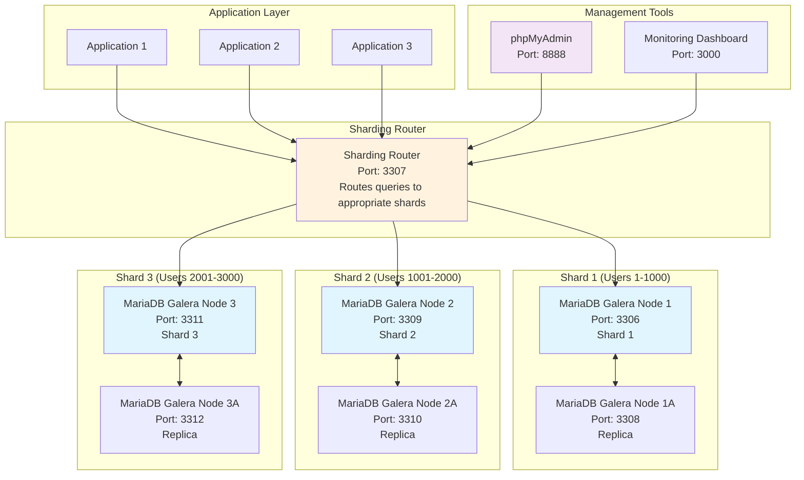

# Database Sharding Lab with MariaDB Galera Cluster

This lab demonstrates horizontal database sharding using MariaDB Galera Cluster with 3 nodes. Sharding distributes data across multiple database instances to improve performance and scalability.

## 🏗️ Architecture



## 📊 Sharding Strategy

### Horizontal Sharding by User ID
- **Shard 1**: User IDs 1-1000
- **Shard 2**: User IDs 1001-2000
- **Shard 3**: User IDs 2001-3000

### Data Distribution
```sql
-- Shard 1 (Port 3306)
CREATE TABLE users (
    id INT PRIMARY KEY,
    username VARCHAR(100),
    email VARCHAR(255),
    shard_id INT DEFAULT 1
) CHECK (id BETWEEN 1 AND 1000);

-- Shard 2 (Port 3309)
CREATE TABLE users (
    id INT PRIMARY KEY,
    username VARCHAR(100),
    email VARCHAR(255),
    shard_id INT DEFAULT 2
) CHECK (id BETWEEN 1001 AND 2000);

-- Shard 3 (Port 3311)
CREATE TABLE users (
    id INT PRIMARY KEY,
    username VARCHAR(100),
    email VARCHAR(255),
    shard_id INT DEFAULT 3
) CHECK (id BETWEEN 2001 AND 3000);
```

## 🚀 Quick Start

### Prerequisites
- Docker and Docker Compose
- At least 6GB RAM available
- Basic understanding of database sharding

### Step 1: Start the Sharding Environment
```bash
cd labs/4-sharding
docker-compose up -d
```

### Step 2: Initialize Shards
```bash
# Initialize shard 1
docker exec -it shard1-node1 mysql -uroot -prootpassword -e "SOURCE /docker-entrypoint-initdb.d/init-shard1.sql"

# Initialize shard 2
docker exec -it shard2-node1 mysql -uroot -prootpassword -e "SOURCE /docker-entrypoint-initdb.d/init-shard2.sql"

# Initialize shard 3
docker exec -it shard3-node1 mysql -uroot -prootpassword -e "SOURCE /docker-entrypoint-initdb.d/init-shard3.sql"
```

### Step 3: Test Sharding
```bash
# Run the sharding test application
cd app
npm install
node sharding-test.js
```

## 🔧 Configuration

### Shard Configuration
Each shard runs a 2-node Galera cluster for high availability:

#### Shard 1
- **Primary**: `shard1-node1:3306`
- **Replica**: `shard1-node2:3308`
- **Data Range**: User IDs 1-1000

#### Shard 2
- **Primary**: `shard2-node1:3309`
- **Replica**: `shard2-node2:3310`
- **Data Range**: User IDs 1001-2000

#### Shard 3
- **Primary**: `shard3-node1:3311`
- **Replica**: `shard3-node2:3312`
- **Data Range**: User IDs 2001-3000

### Sharding Router
- **Port**: 3307
- **Strategy**: User ID-based routing
- **Load Balancing**: Round-robin within shards

## 📈 Performance Benefits

### Before Sharding
- Single database bottleneck
- Limited concurrent connections
- Slow query performance with large datasets

### After Sharding
- **Parallel Processing**: Queries distributed across shards
- **Improved Throughput**: Each shard handles subset of data
- **Better Scalability**: Add more shards as needed
- **Fault Tolerance**: Individual shard failures don't affect others

## 🧪 Testing Scenarios

### 1. Basic Sharding Test
```bash
node test-basic-sharding.js
```
Tests:
- Data insertion across shards
- Query routing to correct shards
- Data consistency within shards

### 2. Performance Comparison
```bash
node test-performance.js
```
Compares:
- Single database vs sharded performance
- Concurrent query handling
- Throughput measurements

### 3. Failover Testing
```bash
node test-failover.js
```
Tests:
- Shard failure scenarios
- Automatic failover to replicas
- Data consistency during failures

### 4. Cross-Shard Queries
```bash
node test-cross-shard.js
```
Tests:
- Queries spanning multiple shards
- Aggregation across shards
- Complex join operations

## 📊 Monitoring

### Access Points
- **phpMyAdmin**: http://localhost:8888
- **Monitoring Dashboard**: http://localhost:3000
- **Sharding Router**: localhost:3307

### Key Metrics
- Query distribution across shards
- Shard response times
- Data distribution balance
- Replication lag

## 🔍 Troubleshooting

### Common Issues

1. **Shard Connection Issues**
   ```bash
   # Check shard status
   docker-compose ps
   
   # Check shard logs
   docker-compose logs shard1-node1
   ```

2. **Data Distribution Problems**
   ```bash
   # Check data distribution
   node check-data-distribution.js
   ```

3. **Performance Issues**
   ```bash
   # Monitor query performance
   node monitor-performance.js
   ```

## 📚 Learning Objectives

By completing this lab, you will understand:

1. **Horizontal Sharding**: How to split data across multiple databases
2. **Sharding Strategies**: Different approaches to data distribution
3. **Query Routing**: How applications route queries to correct shards
4. **Galera Integration**: Using Galera clusters for shard high availability
5. **Performance Optimization**: Improving database performance through sharding
6. **Monitoring**: Tracking shard performance and health

## 🚀 Next Steps

- Experiment with different sharding strategies
- Add more shards to the cluster
- Implement automatic shard rebalancing
- Add cross-shard transaction support
- Integrate with application-level sharding libraries

This lab provides a solid foundation for understanding and implementing database sharding in production environments. 